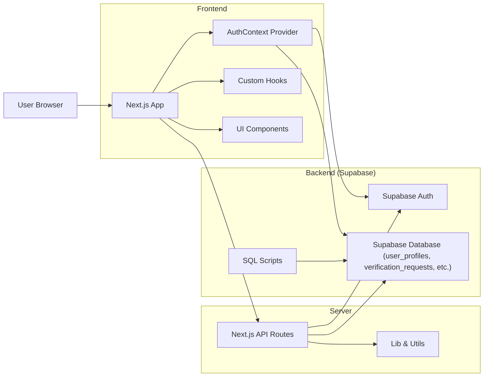
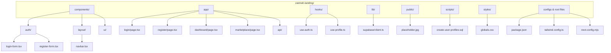

```mermaid
flowchart LR
  Browser["User Browser"] --> NextApp["Next.js App"]
  subgraph "Frontend"
    NextApp
    AuthCtx["AuthContext Provider"]
    Hooks["Custom Hooks"]
    UI["UI Components"]
  end
  subgraph "Server"
    API["Next.js API Routes"]
    ServerUtils["Lib & Utils"]
  end
  subgraph "Backend (Supabase)"
    Auth["Supabase Auth"]
    DB["Supabase Database (user_profiles, verification_requests, etc.)"]
    Scripts["SQL Scripts"]
  end

  NextApp --> AuthCtx
  NextApp --> Hooks
  NextApp --> UI
  AuthCtx --> Auth
  AuthCtx --> DB
  NextApp --> API
  API --> ServerUtils
  API --> DB
  API --> Auth
  Scripts --> DB
```

```mermaid
flowchart TB
  subgraph ProjectRoot["zantrah-landing/"]
    A[components/]
    B[app/]
    C[hooks/]
    D[lib/]
    E[public/]
    F[scripts/]
    G[styles/]
    H[configs & root files]
  end

  A --> A1[auth/]
  A1 --> A1a[login-form.tsx]
  A1 --> A1b[register-form.tsx]
  A --> A2[layout/]
  A2 --> A2a[navbar.tsx]
  A --> A3[ui/]
  B --> B1[login/page.tsx]
  B --> B2[register/page.tsx]
  B --> B3[dashboard/page.tsx]
  B --> B4[marketplace/page.tsx]
  B --> B5[api/]
  C --> C1[use-auth.ts]
  C --> C2[use-profile.ts]
  D --> D1[supabase/client.ts]
  E --> E1[placeholder.jpg]
  F --> F1[create-user-profiles.sql]
  G --> G1[globals.css]
  H --> H1[package.json]
  H --> H2[tailwind.config.ts]
  H --> H3[next.config.mjs]
```

